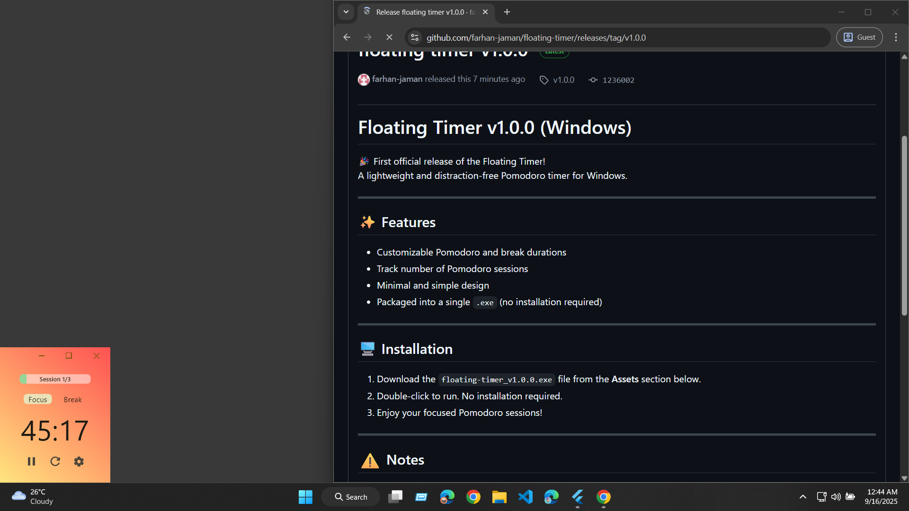
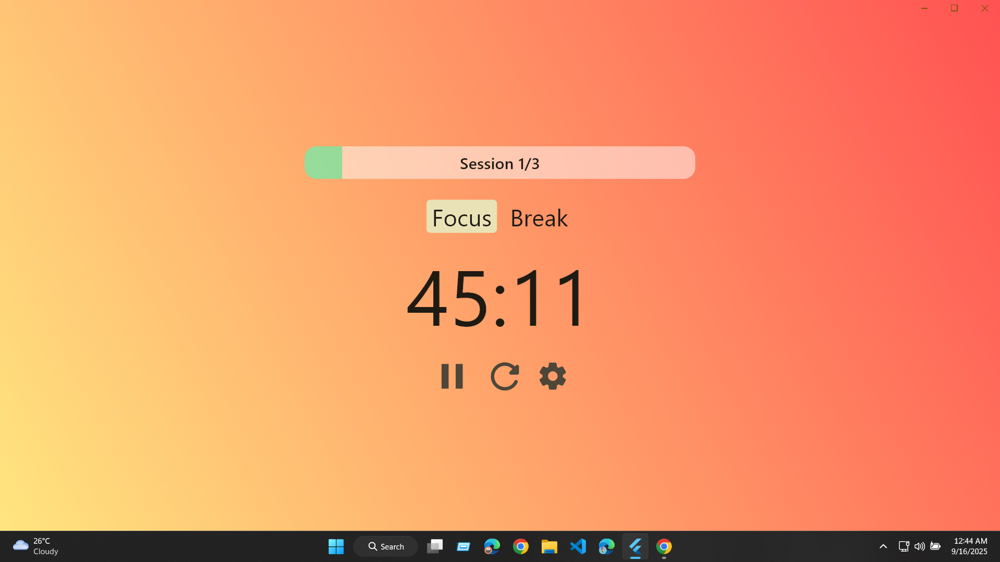
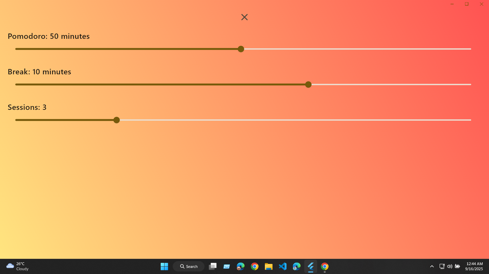

# Floating Timer (Windows)

A simple, lightweight Pomodoro timer for Windows built with Flutter.  
Stay productive with customizable work and break sessions.

---

## ✨ Features
- Set custom Pomodoro and break durations
- Track number of Pomodoros
- Lightweight and distraction-free
- Runs as a standalone Windows app

---

## 🚀 Installation
1. Download the latest `.exe` from the [Releases](https://github.com/farhan-jaman/floating-timer/releases) page.
2. Run the executable, no need to install.
3. Enjoy your focused Pomodoro sessions!

---

## 🖼️ Screenshots

### Main Window


### Fullscreen


### Edit Pomodoro


---

## 🛠️ Development
If you want to build from source:
```bash
git clone https://github.com/farhan-jaman/floating-timer.git
cd floating-timer
flutter pub get
flutter build windows
